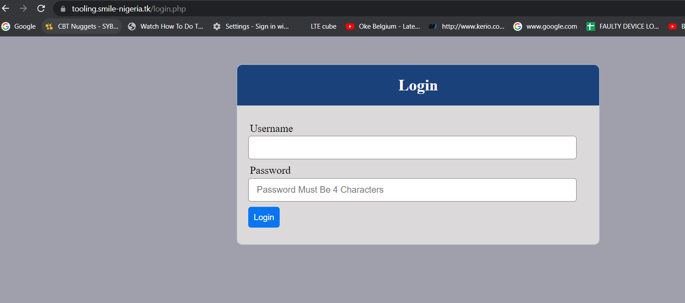
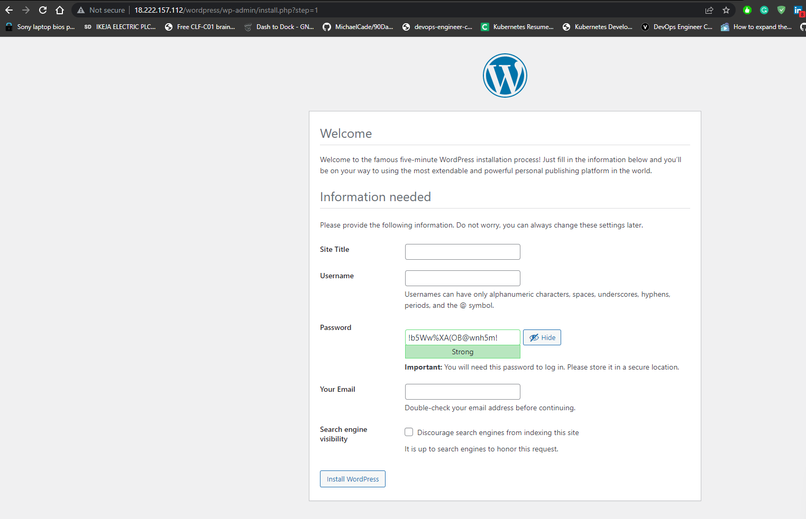

# AUTOMATE INFRASTRUCTURE WITH IAC USING TERRAFORM – TERRAFORM CLOUD

This project introduces us to the concept of terraform cloud which is explained below:

**Terraform Cloud** is a managed service that provides you with Terraform CLI to provision infrastructure, either on demand or in response to various events.

By default, Terraform CLI performs operation on the server whenever it is invoked, it is perfectly fine if you have a dedicated role who can launch it, but if you have a team who works with Terraform – you need a consistent remote environment with remote workflow and shared state to run Terraform commands.

This Project is a continuation of project 18, however, the following will be added:

The files that would be Addedd is;

**PACKER:** for building AMI images

Packer is an open source tool for creating identical machine images for multiple platforms from a single source configuration. Packer is lightweight, runs on every major operating system, and is highly performant, creating machine images for multiple platforms in parallel.

**ANSILE:** for Ansible scripts to configure the infrastucture

**Installing Packer:** 

Packer was installed with chocolatey package manager with the following command:
```markdown
choco install packer

```
**BOTO**

Boto is a software development kit (SDK) designed to improve the use of the Python programming language in Amazon Web Services. The Boto project started as a customer-contributed library to help developers build Python-based applications in the cloud, converting application programming interface (API) responses from AWS into Python classes.

Boto has become the official AWS SDK for Python. Boto versions include Boto, Boto3 and Botocore. Boto3 is the latest version of the SDK, providing support for Python versions 2.6.5, 2.7 and 3.3. Boto3 includes several service-specific features to ease development. Boto supports all current AWS cloud services, including Elastic Compute Cloud, DynamoDB, AWS Config, CloudWatch and Simple Storage Service.

Boto3 replaced Boto version 2, which lacks compatibility with the latest versions of Python, but still appeals to software developers using older versions of the programming language. Botocore provides more rudimentary access to AWS tools, simply making low-level client requests and getting results from APIs.

Boto derives its name from the Portuguese name given to types of dolphins native to the Amazon River.

# terraform-aws-cloud

AWS Cloud Solution For 2 Company Websites Using A Reverse Proxy Technology

**WARNING:** This infrastructure set up is NOT covered by AWS free tier. Therefore, ensure to DELETE  ALL the resources created immediately after finishing the project. Monthly cost may be shockingly high if resources are not deleted. Also, it is strongly recommended to set up a budget and configure notifications when your spendings reach a predefined limit. Watch this video to learn how to configure AWS budget.

The sole aim of this project to build the infrastructure in AWS using terraform.

We will build a secure infrastructure inside AWS VPC (Virtual Private Cloud) network for a fictitious company (Choose an interesting name for it) that uses WordPress CMS for its main business website, and a Tooling Website  for their DevOps team. As part of the company's desire for improved security and performance, a decision has been made to use a reverse proxy technology from NGINX to achieve this.

Cost, Security, and Scalability are the major requirements for this project. Hence, implementing the architecture designed below, ensure that infrastructure for both websites, WordPress and Tooling, is resilient to Web Server's failures, can accomodate to increased traffic and, at the same time, has reasonable cost.

The tooling code is stored in this repository : https://github.com/Livingstone95/tooling


## install graphviz 
sudo apt install graphviz

## use the command below to generate dependency graph
- terraform graph -type=plan | dot -Tpng > graph.png
- terraform graph  | dot -Tpng > graph.png

## Read More about terrafrom graph
https://www.terraform.io/docs/cli/commands/graph.html


### Action Plan for project 19

- Build images using packer
- confirm the AMIs in the console
- update terrafrom script with new ami IDs generated from packer build
- create terraform cloud account and backend
- run terraform script
- update ansible script with values from teraform output
     - RDS endpoints for wordpress and tooling
     - Database name, password and username for wordpress and tooling
     - Access point ID for wordpress and tooling
     - Internal load balancee DNS for nginx reverse proxy

- run ansible script
- check the website


### Draw back in the scripts
- Direct hardcoding of values
- Inputting credentials directly in the script

- Useful links for windows users
https://docs.microsoft.com/en-us/windows-server/administration/openssh/openssh_keymanagement
https://docs.microsoft.com/en-us/windows-server/administration/openssh/openssh_install_firstuse
https://medium.com/risan/upgrade-your-ssh-key-to-ed25519-c6e8d60d3c54


**Challenges and Solution**

1. Ansible did not see aws infrastructure: aws configure

3. Ansible did not update db info: I had to vi into wp-config.php to rectify

4. I realised that when autoscale scale in to zero, all ansible installed data are lost.

5. The servers could not download from the internet: I had to create route table using Natgateway as route

6. Target groups were not automatically registered: I had to manually register them before my instances could be healthy

7. Pip installation was not in the user data for creating AMIs, hence, boto and boto3 were not automatical installed: I had to install manualy, I have corrected the script though.

8. Although, the wordpress site did not open though, but tooling opens as expected

Final Image:





